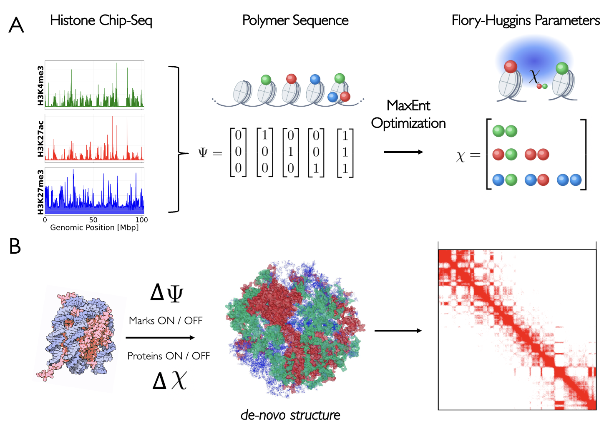

# SCRIBE: Sequence-to-Chromatin structure via epigenetic Representation, Investigation, Benchmarking, and Editing

[](https://github.com/SorenKyhl/SCRIBE-chromatin/actions/workflows/ci.yml)
[](https://www.python.org/downloads/)
[](https://opensource.org/licenses/MIT)
[](https://knowledge.uchicago.edu/record/16570)

<p align="center">
  
</p>

**SCRIBE** (Sequence-to-Chromatin structure via epigenetic Representation, Investigation, Benchmarking, and Editing) is a computational framework for **reading** the epigenetic code by predicting 3D chromatin structure from histone modifications, and **writing** novel sequences for in silico epigenetic engineering. By combining coarse-grained polymer physics with maximum entropy optimization, SCRIBE enables:

- **Direct structure prediction** from ChIP-seq histone modification data
- **Quantitative investigation** of the histone code hypothesis
- **In silico epigenetic engineering** through computational knock-out/knock-in experiments
- **Benchmarking** of sequence-to-structure prediction models

<p align="center">
  
</p>

## Overview

The 3D organization of chromatin plays a critical role in gene regulation. SCRIBE models chromatin as a block copolymer where each monomer's identity is explicitly defined by patterns of histone post-translational modifications (PTMs) from experimental ChIP-seq data. This explicit representation of epigenetic marks is what enables both **reading** and **writing**:

- **Reading**: By learning the effective interaction parameters (Flory-Huggins χ) between epigenetic marks that best reproduce experimental Hi-C contact maps, SCRIBE reveals how the epigenetic code shapes 3D genome organization.
- **Writing**: Because epigenetic sequences are explicit inputs, users can design novel or modified sequences to predict how changes in histone modifications would alter chromatin structure, enabling in silico epigenetic engineering.

**Key features:**
- Nucleosome-resolution simulations of entire chromosomes
- O(N) complexity via Theoretically Informed Coarse Grain (TICG) field-theoretic methods
- No chromatin state-calling required: works directly with continuous ChIP-seq signals

## Installation

### Requirements
- Python 3.8+
- C++17 compiler (gcc 7+ or clang 5+)
- Conda (recommended) or pip

### Quick Install (Recommended)

The easiest way to install SCRIBE is using conda:

```bash
# Clone the repository
git clone https://github.com/SorenKyhl/SCRIBE-chromatin.git
cd SCRIBE-chromatin

# Create and activate conda environment with all dependencies
conda env create -f environment.yml
conda activate scribe

# Build C++ simulation engine and install Python API
make all
```

This command does two things:
1. **Compiles the C++ simulation engine** (`src/`) into a Python extension module (`scribe_engine`) using pybind11
2. **Installs the Python API** (`scribe/`) which provides high-level interfaces for running simulations and maximum entropy optimization

## Documentation

Full documentation is built with [Sphinx](https://www.sphinx-doc.org/) and available at [docs/](docs/). To build locally:

```bash
make docs-open  # Build and open in browser
make docs       # Build only
```


### Data Setup

SCRIBE uses experimental Hi-C and ChIP-seq data for training and validation. The data files are large and hosted externally.

**Data Location:**
- Set `SCRIBE_DATA_DIR` environment variable to specify a custom location
- Default location: `~/.scribe/data/`

```bash
# Optional: Set custom data directory
export SCRIBE_DATA_DIR=/path/to/your/data
```

**Quick Setup (Recommended):**
```bash
# Check what data is available/missing
python -m scribe.download_data --status

# Download all data (~36 GB: Hi-C + ChIP-seq)
python -m scribe.download_data --all

# Or download separately:
python -m scribe.download_data --hic       # Hi-C only (~29 GB)
python -m scribe.download_data --chipseq   # ChIP-seq only (~6.8 GB)
```

## Quick Start

### Loading Data by Cell Type (Recommended)

The high-level `DataPipeline` loads data by cell type, automatically finding files in `~/.scribe/data/`:

```python
from scribe.data_pipeline import DataPipeline
import numpy as np

# Create pipeline for HCT116 cell line data
pipeline = DataPipeline(
    cell="HCT116_auxin",  # Cell line/condition
    chrom=2,               # Chromosome number
    nbeads=1024,           # Number of polymer beads
)

# Check data availability
print(pipeline.status())

# Load Hi-C contact map (with automatic pooling and caching)
hic = pipeline.load_hic()

# Load all ChIP-seq tracks as a dictionary
sequences = pipeline.load_chipseq()
print(f"Loaded tracks: {list(sequences.keys())}")

# Or get as array directly
seq_array = pipeline.load_chipseq_array()

# Save for simulation
np.save("chipseq_sequences.npy", seq_array)
np.save("experimental_hic.npy", hic)
```

### Low-Level Data Loading

For custom file paths or fine-grained control, use `DataLoader`:

```python
from scribe.data_loader import DataLoader
import numpy as np

# Define genomic region explicitly
loader = DataLoader(
    res=100000,          # 100 kbp resolution
    chrom=2,             # chromosome number
    start=0,             # start position (bp)
    end=102_400_000,     # end position (bp)
    size=1024            # number of polymer beads
)

# Load from specific file paths
hic = loader.load_hic("/path/to/file.hic")
sequences = loader.load_chipseq_from_directory("/path/to/chipseq/", method="mean")

seq_array = np.stack(list(sequences.values()), axis=1)
```

### Run a Single Simulation

Run a forward simulation using epigenetic sequences and interaction parameters (χ) to generate an ensemble of 3D genome structures:

```python
from scribe.scribe_sim import ScribeSim
from scribe import default
from scribe.plot_contactmap import plot_contactmap
import numpy as np

# Load default configuration (contains interaction parameters χ)
config = default.config.copy()

# Load polymer sequences (epigenetic mark occupancies from ChIP-seq)
sequences = np.load("chipseq_sequences.npy")

# Create simulation: sequences define bead identities, config defines χ parameters
sim = ScribeSim(root="output", config=config, seqs=sequences)

# Run equilibration + production to generate ensemble of 3D structures
sim.run_eq(eq_sweeps=10000, prod_sweeps=50000)

# Visualize the resulting contact map (averaged over ensemble)
plot_contactmap("output")
```

### Maximum Entropy Optimization

Optimize the Flory-Huggins χ interaction parameters to match experimental Hi-C contact maps. The maximum entropy framework iteratively runs simulations and updates χ until the predicted contact frequencies match the experimental data:

```python
from scribe.maxent import Maxent
from scribe import default

# Load experimental Hi-C contact map (training target)
hic_experimental = np.load("experimental_hic.npy")

# Load polymer sequences from ChIP-seq (defines bead identities)
sequences = np.load("chipseq_sequences.npy")

# Set up maximum entropy optimization
config = default.config.copy()
params = default.params.copy()

me = Maxent(
    root="maxent_output",
    params=params,
    config=config,
    seqs=sequences,       # Input: epigenetic sequences
    gthic=hic_experimental  # Target: experimental Hi-C to match
)

# Run optimization: learns χ parameters that reproduce Hi-C
me.fit()
```

### High-Level MaxentPipeline

The `MaxentPipeline` class is a high-level wrapper for spawning multiple maximum entropy training runs. Use it to systematically compare different sequence representations derived from Hi-C data (e.g., varying the number of principal components):

```python
from scribe.maxent_pipeline import MaxentPipeline
from scribe import epilib as ep
from scribe import default
import functools
import numpy as np

# Load data and config
experimental_hic = np.load("experimental_hic.npy")
config = default.config.copy()
params = default.params.copy()

# Sweep over different numbers of principal components
for k in range(1, 11):
    seqs_method = functools.partial(ep.get_sequences, k=k)
    pipe = MaxentPipeline(
        name=f"pc_{k}",
        gthic=experimental_hic,
        config=config,
        params=params,
        seqs_method=seqs_method  # Derives 2k sequences from Hi-C PCA
    )
    pipe.fit()  # Runs full maximum entropy optimization
```

### Simulation Analysis

Analyze simulation results and compare predicted contact maps to experimental Hi-C:

```python
from scribe.scribe_sim import ScribeSim
from scribe.analysis import sim_analysis, compare_analysis
from scribe.epilib import SCC
from scipy.stats import pearsonr
import numpy as np

# Load a completed simulation
sim = ScribeSim(root="output", load=True)

# Basic analysis: energy convergence, contact map visualization
sim_analysis(sim)

# Compare to experimental Hi-C (ground truth)
experimental_hic = np.load("experimental_hic.npy")
sim.gthic = experimental_hic
compare_analysis(sim)  # Generates comparison plots (scatter, triangle, difference)

# Quantitative metrics
scc = SCC(sim.hic, experimental_hic)           # Stratum-adjusted correlation
pearson_r, _ = pearsonr(sim.hic.flatten(), experimental_hic.flatten())
print(f"SCC: {scc:.3f}, Pearson r: {pearson_r:.3f}")
```

### Maximum Entropy Analysis

Analyze convergence and learned parameters from a completed maximum entropy optimization:

```python
from scribe.maxent import Maxent
import numpy as np
import matplotlib.pyplot as plt

# Load a completed maxent run
me = Maxent(root="maxent_output", load=True)

# Plot optimization convergence (loss and parameter updates)
me.plot_convergence()  # Saves loss.png and param_convergence.png

# Visualize learned χ parameters over iterations
me.plot_plaid_chis(legend=True)  # Track χ_IJ evolution
me.plot_diag_chis()               # Track diagonal parameters

# Load final χ matrix and SCC trajectory
final_chis = np.load("maxent_output/chis.npy")[-1]  # Final χ parameters
scc_trajectory = np.loadtxt("maxent_output/SCC.txt")

# Plot training progress
plt.figure()
plt.plot(scc_trajectory)
plt.xlabel("Iteration")
plt.ylabel("SCC (Stratum-adjusted Correlation)")
plt.title("Maximum Entropy Training Progress")
plt.savefig("training_progress.png")
```

## Software Architecture

```
SCRIBE-chromatin/
├── src/                 # C++ simulation engine (TICG core)
├── scribe/               # Python interface and analysis tools
│   ├── scribe_sim.py         # High-level simulation interface
│   ├── maxent.py        # Maximum entropy optimizer
│   ├── pipeline.py      # End-to-end workflow automation
│   ├── data_pipeline.py  # High-level data loading by cell type
│   ├── data_loader.py    # Low-level file loading (.hic, .bigWig)
│   ├── analysis.py      # Analysis and visualization
│   └── default.py       # Default configurations
├── examples/            # Tutorial notebooks and scripts
├── defaults/            # Default configuration files
└── scripts/             # Analysis and batch processing scripts
```

### Module Hierarchy

| Module | Level | Description |
|--------|-------|-------------|
| `scribe_engine` | Low | C++ extension (pybind11 wrapper) |
| `scribe_sim.ScribeSim` | High | Simulation setup, execution, and I/O |
| `maxent.Maxent` | Low | Core maximum entropy optimization |
| `maxent_pipeline.MaxentPipeline` | High | Maximum entropy optimization workflow |
| `data_pipeline.DataPipeline` | High | Load data by cell type from ~/.scribe/data/ |
| `data_loader.DataLoader` | Low | Load from specific .hic and .bigWig files |

## Examples

See the `examples/` directory for detailed tutorials:

- **`single-simulation/`** - Basic simulation setup and execution
- **`chipseq_maxent/`** - Training on ChIP-seq data
- **`sweep_pcs/`** - Parameter sweep over principal components
- **`snippets/`** - Useful code snippets for common tasks

## Citation

If you use SCRIBE in your research, please cite:

```bibtex
@phdthesis{kyhl2025investigating,
  title={Investigating the epigenetic code through data-driven chromosome structure modeling},
  author={Kyhl, Soren},
  year={2025},
  school={University of Chicago},
  url={https://knowledge.uchicago.edu/record/16570}
}
```

For an example application using graph neural networks trained on SCRIBE-generated data:

```bibtex
@article{schultz2025chromatin,
  title={Chromatin structures from integrated AI and polymer physics model},
  author={Schultz, Matthew and Kyhl, Soren and de Pablo, Juan J.},
  journal={PLOS Computational Biology},
  year={2025},
  doi={10.1371/journal.pcbi.1012912}
}
```

## License

This project is licensed under the MIT License - see the [LICENSE](LICENSE) file for details.

## Acknowledgments

Developed in the [de Pablo Lab](https://pme.uchicago.edu/group/de-pablo-group) at the University of Chicago Pritzker School of Molecular Engineering.


