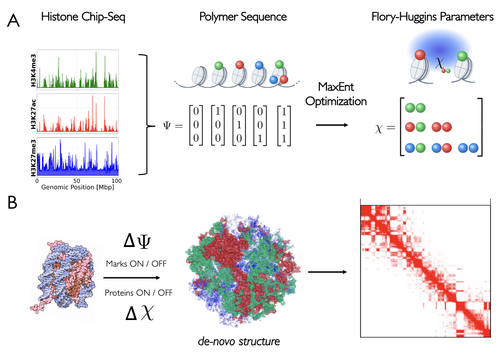

# SCRIBE: Sequence-to-Chromatin structure via epigenetic Representation, Investigation, Benchmarking, and Editing

[](https://github.com/SorenKyhl/SCRIBE-chromatin/actions/workflows/ci.yml)
[](https://www.python.org/downloads/)
[](https://opensource.org/licenses/MIT)
[](https://knowledge.uchicago.edu/record/16570)

<p align="center">
  
</p>

**SCRIBE** (Sequence-to-Chromatin structure via epigenetic Representation, Investigation, Benchmarking, and Editing) is a computational framework for **reading** the epigenetic code by predicting 3D chromatin structure from histone modifications, and **writing** novel sequences for in silico epigenetic engineering. By combining coarse-grained polymer physics with maximum entropy optimization, SCRIBE enables:

- **Direct structure prediction** from ChIP-seq histone modification data
- **Quantitative investigation** of the histone code hypothesis
- **In silico epigenetic engineering** through computational knock-out/knock-in experiments
- **Benchmarking** of sequence-to-structure prediction models

<p align="center">
  
</p>

## Overview

The 3D organization of chromatin plays a critical role in gene regulation. SCRIBE models chromatin as a block copolymer where each monomer's identity is explicitly defined by patterns of histone post-translational modifications (PTMs) from experimental ChIP-seq data. This explicit representation of epigenetic marks is what enables both **reading** and **writing**:

- **Reading**: By learning the effective interaction parameters (Flory-Huggins χ) between epigenetic marks that best reproduce experimental Hi-C contact maps, SCRIBE reveals how the epigenetic code shapes 3D genome organization.
- **Writing**: Because epigenetic sequences are explicit inputs, users can design novel or modified sequences to predict how changes in histone modifications would alter chromatin structure, enabling in silico epigenetic engineering.

**Key features:**
- Nucleosome-resolution simulations of entire chromosomes
- O(N) complexity via Theoretically Informed Coarse Grain (TICG) field-theoretic methods
- No chromatin state-calling required: works directly with continuous ChIP-seq signals

## Installation

### Requirements
- Python 3.8+
- C++17 compiler (gcc 7+ or clang 5+)
- Conda (recommended) or pip

### Quick Install (Recommended)

The easiest way to install SCRIBE is using conda:

```bash
# Clone the repository
git clone https://github.com/SorenKyhl/SCRIBE-chromatin.git
cd SCRIBE-chromatin

# Create and activate conda environment with all dependencies
conda env create -f environment.yml
conda activate scribe

# Build C++ simulation engine and install Python API
make all
```

This command does two things:
1. **Compiles the C++ simulation engine** (`src/`) into a Python extension module (`scribe_engine`) using pybind11
2. **Installs the Python API** (`scribe/`) which provides high-level interfaces for running simulations and maximum entropy optimization

## Documentation

Full documentation is built with [Sphinx](https://www.sphinx-doc.org/) and available at [docs/](docs/). To build locally:

```bash
make docs-open  # Build and open in browser
make docs       # Build only
```

## Quick Start

The fastest way to get started is to run the self-contained scripts in
[`examples/quickstart/`](examples/quickstart/). They download an example
HCT116 Hi-C + ChIP-seq dataset (if not already present), process it into
polymer sequences, and run a full simulation or maximum-entropy optimization
end to end:

```bash
cd examples/quickstart

# Data -> forward simulation -> contact map comparison
python full_simulation.py

# Data -> maximum entropy optimization of chi parameters
python full_maxent.py
```

Both scripts write their outputs relative to the current directory, so you
can run them from any results directory you like, e.g.:

```bash
mkdir -p /path/to/results/run1 && cd /path/to/results/run1
python /path/to/SCRIBE-chromatin/examples/quickstart/full_simulation.py
```

`examples/quickstart/` also has a numbered set of scripts
(`01_download_data.py` through `06_pipeline_sweep.py`) that break the same
workflow into individual steps, useful for inspecting or customizing one
stage at a time. See [`examples/quickstart/README.md`](examples/quickstart/README.md)
for the full list.

For a walkthrough of the same steps as library calls (data loading,
`ScribeSim`, `Maxent`, `MaxentPipeline`, and result analysis), see the
[Quick Start docs](docs/source/quickstart.rst) and
[Analysis docs](docs/source/analysis.rst).

## Software Architecture

SCRIBE follows a layered architecture separating simulation dispatch, result analysis, and pipeline orchestration:

```
SCRIBE-chromatin/
├── src/                      # C++ simulation engine (TICG core)
├── scribe/                   # Python interface and analysis tools
│   ├── scribe_sim.py         # Simulation dispatcher (ScribeSim)
│   ├── analysis.py           # Result inspection (SimulationResult, metrics)
│   ├── analysis_pipeline.py  # Analysis workflows (sim_analysis, compare_analysis)
│   ├── maxent.py             # Maximum entropy optimizer (Maxent)
│   ├── maxent_pipeline.py    # MaxEnt workflow automation (MaxentPipeline)
│   ├── data_pipeline.py      # High-level data loading by cell type
│   ├── data_loader.py        # Low-level file loading (.hic, .bigWig)
│   └── default.py            # Default configurations
├── examples/                 # Tutorial notebooks and scripts
├── defaults/                 # Default configuration files
└── tests/                    # Unit and integration tests
```

### Module Hierarchy

The Python API is organized into three conceptual layers:

| Module | Role | Description |
|--------|------|-------------|
| `scribe_engine` | Engine | C++ extension (pybind11 wrapper) for TICG simulation |
| `scribe_sim.ScribeSim` | Dispatcher | Set up, configure, and run simulations |
| `analysis.SimulationResult` | Inspector | Load and analyze completed simulation outputs |
| `analysis_pipeline` | Orchestrator | High-level analysis workflows (plotting, comparison) |
| `maxent.Maxent` | Optimizer | Core maximum entropy optimization loop |
| `maxent_pipeline.MaxentPipeline` | Orchestrator | Spawn and manage multiple MaxEnt runs |
| `data_pipeline.DataPipeline` | Loader | Load Hi-C/ChIP-seq by cell type from ~/.scribe/data/ |
| `data_loader.DataLoader` | Loader | Low-level file I/O for .hic and .bigWig files |

### Design Philosophy

- **ScribeSim** (dispatcher): Handles simulation lifecycle—configuration, execution, checkpointing
- **SimulationResult** (inspector): Reads completed simulation outputs for analysis and metric computation  
- **analysis_pipeline** (orchestrator): Combines analysis steps into reusable workflows

## Examples

See the `examples/` directory for detailed tutorials:

- **`quickstart/`** - Full workflow scripts and step-by-step numbered examples (start here)
- **`single-simulation/`** - Basic simulation setup and execution
- **`chipseq_maxent/`** - Training on ChIP-seq data
- **`sweep_pcs/`** - Parameter sweep over principal components
- **`snippets/`** - Useful code snippets for common tasks

## Citation

If you use SCRIBE in your research, please cite:

```bibtex
@phdthesis{kyhl2025investigating,
  title={Investigating the epigenetic code through data-driven chromosome structure modeling},
  author={Kyhl, Soren},
  year={2025},
  school={University of Chicago},
  url={https://knowledge.uchicago.edu/record/16570}
}
```

For an example application using graph neural networks trained on SCRIBE-generated data:

```bibtex
@article{schultz2025chromatin,
  title={Chromatin structures from integrated AI and polymer physics model},
  author={Schultz, Matthew and Kyhl, Soren and de Pablo, Juan J.},
  journal={PLOS Computational Biology},
  year={2025},
  doi={10.1371/journal.pcbi.1012912}
}
```

## License

This project is licensed under the MIT License - see the [LICENSE](LICENSE) file for details.

## Acknowledgments

Developed in the [de Pablo Lab](https://pme.uchicago.edu/group/de-pablo-group) at the University of Chicago Pritzker School of Molecular Engineering.


